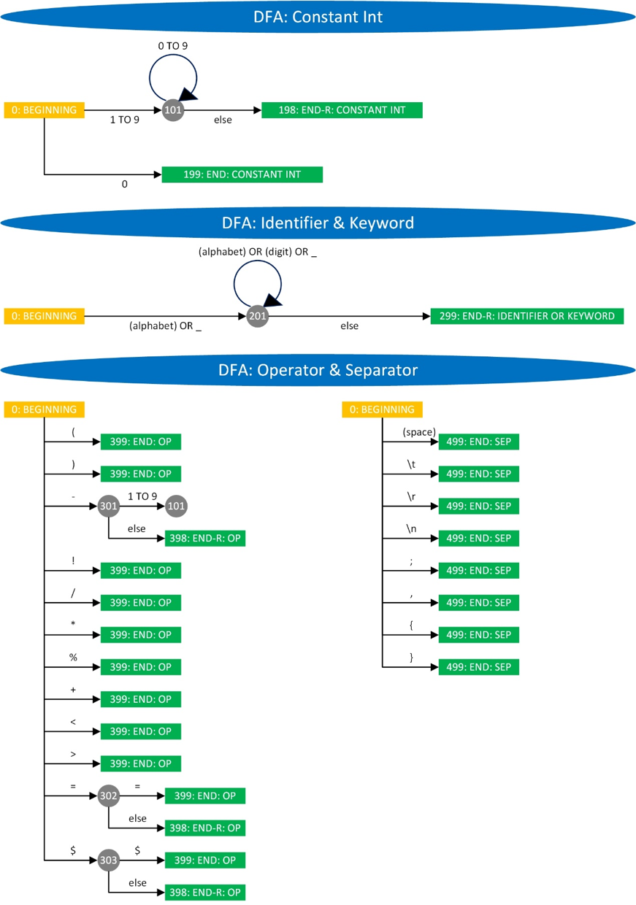

# C-like Compiler

### 1. Design Goal

#### 1.1. Overall Goal

- input: a source file in C programing language (not strict)
- output: a intermediate language file in x86-64 assembly language (not strict)
- development language: C++ programing language
- development tool: Microsoft Visual Studio 2013 Ultimate
- design method: the process-oriented method and the object-based method

#### 1.2. Supported Element in Source File

- the annotation `/**/`
- the 64-bit integer: the 64-bit integer constant (minus supported) and the 64-bit integer variable
- the arithmetical expression: adding `+`, subtracting `-`, multiplying `*`, dividing `/`, calculating remainder `%` and assignment `=` of the 64-bit integer
- the logical expression: "greater than" `>`, "smaller than" `<` and "equal to" `==` of the 64-bit integer
- "not" `!` of the logical expression
- the specific operation `$` `$$`: satisfy the requirement of operator precedence summary
- the separator `[space]` `\t` `\r` `\n` `;` `{` `}`
- the switch structure `if` `if ... else ...`
- the looping structure `while`
- the input `input`
- the output `output`
- the definition of the function
- the call of the the function

### 2. Code Structure

- `main.cpp`: steps of the whole program
- `error.h`: errors in the source file
- `function_item.h`: information of each function head
  - return value
  - parameters
  - block location (in the source file, the same below)
  - compiling result
- `parser_item.h`: the left part and the right part of each parser
- `source_file.h`: information of the source file
  - content
  - size
  - line locations
  - annotation locations
- `block.h`: information of each block
  - name
  - compiling result
- `annotation_item.h`: information of each annotation
  - beginning location
  - end location
- `code_item.h`: information of each intermediate language instruction
  - label
  - operation
  - target operand
  - source operand
- `variable_item.h`: information of each variable
  - name
  - global name
  - type
- `word.h`: information of word (minimum part of lexical analysis, use pointer to construct doubly linked link)
  - content
  - type
  - location

### 3. Program Realization

Several processes are included in the program (in `main.cpp`):

- reading the source file: `ReadSourceFile()`
- **preprocessing: `Preprocess`**
- **lexical analysis: `LexicalAnalyse()`**
- remove blank part: `RemoveBlankWord()`
- **grammar analysis, semantic analysis and generating intermediate language instructions of function head: `ParseFunctionHead()`**
- searching main function: `SearchMainFunction()`
- **grammar analysis, semantic analysis and generating intermediate language instructions of block: `ParseBlock()`**
- writing the intermediate language file: `WriteIntermediateFile()`

 The parts shown in bold are explained further following the listing.

#### 3.1. Preprocessing

The tasks of preprocessing are:

- recording the location of the beginning and the end of
  - each line
  - each annotation `/* */`
  - each function
  - each block `{ }`
- linking each function with its block
- constructing tree of blocks according to their inclusion relation

#### 3.2. Lexical Analysis

Here is the DFA in lexical analysis:

- "END": an end of identifying
- "END-R": an end of identifying and a character rollback
- "else": other characters



#### 3.3. Grammar Analysis, Semantic Analysis and Generating Intermediate Language Instruction of Function Head

Here is the grammar of the function head (like `void display(int a, int b)`):

- Words shown in read and bold are terminal symbols.


It is not an operator precedence grammar.

#### 3.4. Grammar Analysis, Semantic Analysis and Generating Intermediate Language Instruction of Block

Here is the grammar of each block (like `{ int a; int b; int c; c = a + b; return c; }`):

- Words shown in red and bold are terminal symbols.
- Lines with yellow filling will be merged while converting to the machine view (of the grammar, the same below).
- Lines with pink filling will be deleted while conventing to the machine view.


It is an operator precedence grammar (not strict).

Here is the FIRSTVT and the LASTVT:

- Cells of "T" with yellow filling mean "true" and others mean "false".


Here is the preference relation table:

- "@" means the bottom of the symbol stack, which is not exist in a correct source file.


In fact, this is not an operator precedence grammar strictly, because this algorithm ends up with sentences (SE) rather than blocks.

There are still two problems:

- There is no definition of preference relations between terminal symbol of sentence `;` or `}` and the next symbol.
- Symbol stack will be fill up with non-terminal symbols in the end.

Two modification are made to solve these problems:

- Define that preference relations between terminal symbol of sentence `;` or `}` and the next symbol is ">". It is shown by cells with blue filling in the picture above.
- Non-terminal symbols will not be pushed into symbol stack if sentences (SE) appear. It is shown in the left part named "remove" in the picture below.

Before programming, the grammar should be converted to the machine view. Here is it:

- Words shown in read and bold are terminal symbols, which could be looked up in the picture above.
- All non-terminal symbols are converted to -1.
- Yellow filling lines in the grammar are merged.

.png)

In the algorithm of processing the operator precedence grammar, all non-terminal symbols are indiscriminate. So all of they are converted the same value (-1).

In addition, the algorithm could not deal with "non-terminal symbol ---> non-terminal symbol". Exactly, such grammar item could not be linked to any compiling action (that is why lines with pink filling in the grammar are removed while converting). Apparently, this will lead to some ambiguity problems. The only way to solve these problem is to introduce other methods and informations.

### 4. Running Result

Get executable file from [here](https://github.com/zzc-tongji/c-like-compiler/releases).

#### 4.1. Success Situation

- source file:


```c
/* add_i */
int add_i(int a, int b, int c)
{
	int temp;
	temp = a + b;
	return temp;
}

/* sub_i */
int sub_i(int a, int b)
{
	int temp;
	temp = a - b;
	return temp;
}

/* mul_i */
int mul_i(int a, int b)
{
	int temp;
	temp = a * b;
	return temp;
}

/* div_i */
int div_i(int a, int b)
{
	int temp;
	temp = a / b;
	return temp;
}

/* main */
void main()
{
	int i1;
	int i2;

	int ri1;
	int ri2;
	int ri3;
	int ri4;

	i1 = -1;
	i2 = 2;

	ri1 = $ add_i(i1, i2) $;
	ri2 = $ sub_i(i1, i2) $;
	ri3 = $ mul_i(i1, i2) $;
	ri4 = $ div_i(i1, i2) $;

	int a;
	int b;
	int c;

	c = a - b;
	if (c == a)
	{
		/* empty */
	}
	c = a / b;
	c = a * b;
	c = a % b;
	c = a + b;
	if (c < a)
	{
		/* empty */
	}
	if (c > a)
	{
		/* empty */
	}
	if (c == a)
	{
		/* empty */
	}

	a = 100;
	b = 200;
	c = 150;

	input $$ a $$;

	while (a < b)
	{
		a = a + 3;
		if (a < c)
		{
			b = b + 2;
		}
		else
		{
			b = b + 1;
		}
	}

	output $$ a $$;
}

/*
	end
*/
```

- target file:

```assembly
PROGRAM START
                    CALL main
PROGRAM END


add_i:
                    JMP block_0_in
block_0_out:
                    RET RC1


sub_i:
                    JMP block_1_in
block_1_out:
                    RET RC1


mul_i:
                    JMP block_2_in
block_2_out:
                    RET RC1


div_i:
                    JMP block_3_in
block_3_out:
                    RET RC1


main:
                    JMP block_4_in
block_4_out:
                    RET RC1


block_0_in:
                    MOV RC1 function_add_i_a
                    MOV RC2 function_add_i_b
                    ADD RC1 RC2
                    MOV block_0_temp RC1
                    MOV RC1 block_0_temp
                    JMP block_0_out


block_1_in:
                    MOV RC1 function_sub_i_a
                    MOV RC2 function_sub_i_b
                    SUB RC1 RC2
                    MOV block_1_temp RC1
                    MOV RC1 block_1_temp
                    JMP block_1_out


block_2_in:
                    MOV RC1 function_mul_i_a
                    MOV RC2 function_mul_i_b
                    MUL RC1 RC2
                    MOV block_2_temp RC1
                    MOV RC1 block_2_temp
                    JMP block_2_out


block_3_in:
                    MOV RC1 function_div_i_a
                    MOV RC2 function_div_i_b
                    DIV RC1 RC2
                    MOV block_3_temp RC1
                    MOV RC1 block_3_temp
                    JMP block_3_out


block_4_in:
                    MOV RC1 -1
                    MOV block_4_i1 RC1
                    MOV RC1 2
                    MOV block_4_i2 RC1
                    PARAMETER block_4_i1
                    MOV RC1 block_4_i2
                    PARAMETER R1
                    CALL add_i
                    MOV block_4_ri1 RTV
                    PARAMETER block_4_i1
                    MOV RC1 block_4_i2
                    PARAMETER R1
                    CALL sub_i
                    MOV block_4_ri2 RTV
                    PARAMETER block_4_i1
                    MOV RC1 block_4_i2
                    PARAMETER R1
                    CALL mul_i
                    MOV block_4_ri3 RTV
                    PARAMETER block_4_i1
                    MOV RC1 block_4_i2
                    PARAMETER R1
                    CALL div_i
                    MOV block_4_ri4 RTV
                    MOV RC1 block_4_a
                    MOV RC2 block_4_b
                    SUB RC1 RC2
                    MOV block_4_c RC1
                    MOV RC1 block_4_c
                    MOV RC2 block_4_a
                    CMP RC1 RC2
                    JE block_4_label_0
                    MOV RL 0
                    JMP block_4_label_1
block_4_label_0:
                    MOV RL 1
block_4_label_1:
                    CMP RL 0
                    JE block_4_label_2
                    JMP block_5_in
block_5_out:
block_4_label_2:
                    MOV RC1 block_4_a
                    MOV RC2 block_4_b
                    DIV RC1 RC2
                    MOV block_4_c RC1
                    MOV RC1 block_4_a
                    MOV RC2 block_4_b
                    MUL RC1 RC2
                    MOV block_4_c RC1
                    MOV RC1 block_4_a
                    MOV RC2 block_4_b
                    MOD RC1 RC2
                    MOV block_4_c RC1
                    MOV RC1 block_4_a
                    MOV RC2 block_4_b
                    ADD RC1 RC2
                    MOV block_4_c RC1
                    MOV RC1 block_4_c
                    MOV RC2 block_4_a
                    CMP RC1 RC2
                    JL block_4_label_3
                    MOV RL 0
                    JMP block_4_label_4
block_4_label_3:
                    MOV RL 1
block_4_label_4:
                    CMP RL 0
                    JE block_4_label_5
                    JMP block_6_in
block_6_out:
block_4_label_5:
                    MOV RC1 block_4_c
                    MOV RC2 block_4_a
                    CMP RC1 RC2
                    JG block_4_label_6
                    MOV RL 0
                    JMP block_4_label_7
block_4_label_6:
                    MOV RL 1
block_4_label_7:
                    CMP RL 0
                    JE block_4_label_8
                    JMP block_7_in
block_7_out:
block_4_label_8:
                    MOV RC1 block_4_c
                    MOV RC2 block_4_a
                    CMP RC1 RC2
                    JE block_4_label_9
                    MOV RL 0
                    JMP block_4_label_10
block_4_label_9:
                    MOV RL 1
block_4_label_10:
                    CMP RL 0
                    JE block_4_label_11
                    JMP block_8_in
block_8_out:
block_4_label_11:
                    MOV RC1 100
                    MOV block_4_a RC1
                    MOV RC1 200
                    MOV block_4_b RC1
                    MOV RC1 150
                    MOV block_4_c RC1
                    INPUT block_4_a
                    MOV RC1 block_4_a
                    MOV RC2 block_4_b
                    CMP RC1 RC2
                    JL block_4_label_12
                    MOV RL 0
                    JMP block_4_label_13
block_4_label_12:
                    MOV RL 1
block_4_label_13:
block_4_label_15:
                    CMP RL 0
                    JE block_4_label_14
                    JMP block_9_in
block_9_out:
                    JMP block_4_label_15
block_4_label_14:
                    OUTPUT block_4_a
                    JMP block_4_out


block_5_in:
                    JMP block_5_out


block_6_in:
                    JMP block_6_out


block_7_in:
                    JMP block_7_out


block_8_in:
                    JMP block_8_out


block_9_in:
                    MOV RC1 block_4_a
                    MOV RC2 3
                    ADD RC1 RC2
                    MOV block_4_a RC1
                    MOV RC1 block_4_a
                    MOV RC2 block_4_c
                    CMP RC1 RC2
                    JL block_9_label_0
                    MOV RL 0
                    JMP block_9_label_1
block_9_label_0:
                    MOV RL 1
block_9_label_1:
                    CMP RL 0
                    JE block_9_label_2
                    JMP block_10_in
block_10_out:
                    JMP block_9_label_3
block_9_label_2:
                    JMP block_11_in
block_11_out:
block_9_label_3:
                    JMP block_9_out


block_10_in:
                    MOV RC1 block_4_b
                    MOV RC2 2
                    ADD RC1 RC2
                    MOV block_4_b RC1
                    JMP block_10_out


block_11_in:
                    MOV RC1 block_4_b
                    MOV RC2 1
                    ADD RC1 RC2
                    MOV block_4_b RC1
                    JMP block_11_out
```

#### 4.2. Some Failure Situation

##### 4.2.1. Illegal Character


##### 4.2.2. Syntex Error


##### 4.2.3. Using Variable Without Definition


### 5. Others

- All ".md" files are edited by [Typora](http://typora.io).
- Style of all ".md" files is [Github Flavored Markdown](https://guides.github.com/features/mastering-markdown/#GitHub-flavored-markdown).
- There is a CRLF (Windows) at end of each line.
